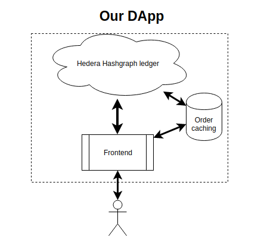
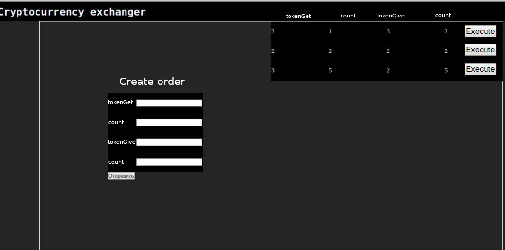

# Первый DApp на Hedera Hashgraph

## Введение
В данной статье хочу описать собственный опыт взаимодействия с платформой Hedera Hashgraph в процессе разработки собственного DApp.

Итак, я задался целью разработать своё первое приложение на Hedera Hashgraph.
Моим проектом будет криптовалютный обменник, в котором пользователи смогут обмениваться ERC-20 токенами и Hbarами. Такое приложение несложно в реализации на стороне смарт-контрактов.

Самым поддерживаемым на данный момент инструментом для работы с HH является Java SDK for Hedera, что меня не устраивало, как разработчика на Node.js. Помимо Java SDK, существует ещё SDK на языке Rust. Это второй по качеству поддержки инструмент для Hedera. Однако в нём не в полной мере реализованы методы по взаимодействию со смарт-контрактами.


## Hedera JavaScript API 
Наша команда долго искала решение, и оно было найдено. Мы отказались от идеи писать с нуля SDK на javascript и решили обернуть примеры из Rust SDK в собственную библиотеку на node.js с помощью FFI. 
Проблемы, с которыми мы столкнулись, касались передачи строковых данных:
- Передача строковых данных между javascript и rust. Стандартный строковый тип языка Rust не может передаваться корректно через ffi, поэтому мы использовали CString.
- Используя CString, Rust работает с utf-8, в то время как node.js использует utf-16. Нам пришлось создать специальные функции для перевода кодировок из одной в другую при подаче/выводе данных.

Пришлось самостоятельно доработать Rust SDK для ffi. Также был доработан функционал работы со SC. Было решено сделать ставку на простоту взаимодействия с платформой, поэтому мы исключили работу с запросами и транзакциями, дав возможность разработчикам просто вызывать методы платформы, как в web3.
Итак, теперь у нас есть Hedera JavaScript API.

На данный момент реализован минимальный функционал для разработки DApp:

```
createFileFromFile(...) - загружает файл на файловый сервис HH
appendFile(...) - дописать файл, уже расположенный в сервисах HH
createContract(...) - создаёт смарт-контракт, ссылаясь на байт-код
callContract(...) - вызывает метод уже запущенного смарт-контракта
getAccount(...) - вызывает текущий баланс аккаунта
```

Возможность подписи на события пока не поддерживается в HH, однако с появлением mirror nodes будет такая возможность.

## Разработка DApp (Туториал)

Проект DApp вы можете найти [здесь](https://github.com/ZhdanoffAlexey/cryptocurrency-exchanger-hedera).

Скачать Hedera JavaScript API вы можете [здесь](https://github.com/xclbrio/hederajs)

### Структура DApp и смарт-контракт

DApp будет представлять из себя SC на Solidity и frontend-часть на express (node.js). Для математических операций будем использовать openzeppelin.




В нашем обменнике пользователь сможет:
1) __Создать ордер обмена одной криптовалюты на другую__. Из-за невозможности подписываться на события, реализовать взаимодействие с DApp будет гораздо сложнее. Высокая скорость осущестления транзакций в Hedera Hashgraph позволяет обойти эту проблему. Хранить ордера будем в двумерном массиве.
Логика взаимодействия с ордерами также нетривиальна: пользователь вызывает функцию создания ордера, передавая `(tokenGet, amountGet, tokenGive, amountGive)` в метод. Для исполнения ордера необходимо указать уникальное значение ордера либо через заранее сгенерированный hash по его полям, либо через позицию в массиве (для простоты эксперимента я взял последний вариант, однако рекомендую первый).
```
	// создание ордера
	// dataArray[...][0] - статус ордера (0 - не существует, 1 - открыт, 2 - закрыт)
	// dataArray[...][1] - номер токена, который покупаем (параметр tokenGet)
	// dataArray[...][2] - количество покупаемых токенов (параметр amountGet)
	// dataArray[...][3] - номер токена, который продаём (параметр tokenGive)
	// dataArray[...][4] - количество продаваемых токенов (параметр amountGive)
	function order(uint tokenGet, uint amountGet, uint tokenGive, uint amountGive) public returns(uint) {
		uint index = dataArray.length - 1;
		dataArray[index][0] = 1;
		dataArray[index][1] = tokenGet;
		dataArray[index][2] = amountGet;
		dataArray[index][3] = tokenGive;
		dataArray[index][4] = amountGive;
		addressesArray.push(msg.sender);
		
		// для удобства сканирования будем добавлять нулевой ордера для удобства сканирования
		// требуется явно указать, что 0 пренадлежит uint256
		uint256 zeroNum = 0;
		uint[5] memory tempArray = [zeroNum,zeroNum,zeroNum,zeroNum,zeroNum];
		dataArray.push(tempArray);
		return index;
		}
```
2) __Исполнить уже существующий одрер__:
```
	function trade(uint order) public {
		tradeBalances(dataArray[order][1], dataArray[order][2], dataArray[order][3], dataArray[order][4], addressesArray[order]);
		dataArray[order][0] = 2;
	}
	
	// обменять балансы пользователей
	function tradeBalances(uint tokenGet, uint amountGet, uint tokenGive, uint amountGive, address user) private {
		tokens[msg.sender][tokenGet] = safeSub(tokens[msg.sender][tokenGet], amountGet);
		tokens[user][tokenGet] = safeAdd(tokens[user][tokenGet], amountGet);
		tokens[user][tokenGive] = safeSub(tokens[user][tokenGive], amountGive);
		tokens[msg.sender][tokenGive] = safeAdd(tokens[msg.sender][tokenGive], amountGive);
	}
```
3) __Отменить собственный ордер__;
4) __Ввод/вывод ERC20/Hbar-токенов на личный счёт обменника__.

У пользователя для работы с обменником будет собственный кошёлёк. Таким образом, сюда добавятся функции:
Для хранения счёта пользователя у нас будет mapping с ключами [userAddress][token]


### Подготовка Hedera JavaScript API
Для компиляции Rust SDK nightly-версия Rust и установленный Protocol Buffers.
Выполним компиляцию:
```
cd rust_hedera_sdk
cargo build
```
### Деплой SC Dapp

Отлично, код смарт-контракта написан, а API готов к использованию. Как задеплоить контракт в Hedera Hashgraph?
Разберём последовательность действий для деплоя SC. Выполнять процедуры ниже будем из node.js:
1) Сгенерировать ABI для вызова методов и байткод контракта (через Truffle или Remix).
2) Загрузить байт-код контракта на платформу HH как .bin файл. 
```
const Excalibur_ = require("./lib/JavaScript/Excalibur");

// set node settings
const nodeAddress = "t1.hedera.com:50000";
const nodeAccount = "0.0.3";
const excalibur = new Excalibur_(nodeAddress, nodeAccount);

// set user settings
const userAccount = "0.0.***";
const userPrivateKey = "***";

const pathToFile = "smartContracts/excalibur.bin";

excalibur.createFileFromFile(userAccount,userPrivateKey,pathToFile)
```
ВАЖНО! У файлового сервиса Hedera Hashgraph существует ограничение веса файлов в 6кб (ранее было заявлено 4кб, на практике оказалось другое значение). Учтите данное ограничение, очень часто вес байткода получается больше заданного лимита. В таком случае платформа позволяет загружать файл по частям, используя метод: append_file(userAccount, userPrivateKey, fileID, appendText)

В случае успеха функция вернёт специальный номер файла (например, 0.0.1035).

3) Создать смарт-контракт, ссылаясь на номер файла с байткодом, уже находящегося в сети:
```
// set node settings
const nodeAddress = "t1.hedera.com:50000";
const nodeAccount = "0.0.3";
const excalibur = new Excalibur_(nodeAddress, nodeAccount);

// set user settings
const userAccount = "0.0.***";
const userPrivateKey = "***";

// create contract settings
const fileID = "0.0.****";
const gasValue = "100000";

createContract(userAccount, userPrivateKey, fileID, gasValue)
```
В случае успеха возвращается номер смарт-контракта (например, 0.0.1536).


### Вызов метода SC

Для работы со SC необходим его Abi.
Вызовем метод запущенного нами смарт-контракта. Например, исполним существующий ордер:
```
// set node settings
const nodeAddress = "t1.hedera.com:50000";
const nodeAccount = "0.0.3";
const excalibur = new Excalibur_(nodeAddress, nodeAccount);

// set user settings
const userAccount = "0.0.***";
const userPrivateKey = "***";

// create contract settings
const contractID = "0.0.****";
const gasValue = "100000";
const pathToAbi = "smartContracts/excalibur.abi"

const methodName = "order";

// номер ордера, который мы хотим исполнить
const arguments = "6";

// amount - количество передаваемых Hbar
// данный метод не относится к типу payable, поэтому указываем 0
const amount = "0";

excalibur.callContract(userAccount, userPrivateKey, contractID, gasValue, pathToAbi, methodName, amount, arguments);
```

### front-end Dapp

Вот как выглядит фронтенд обменника, созданный на скорую руку 




